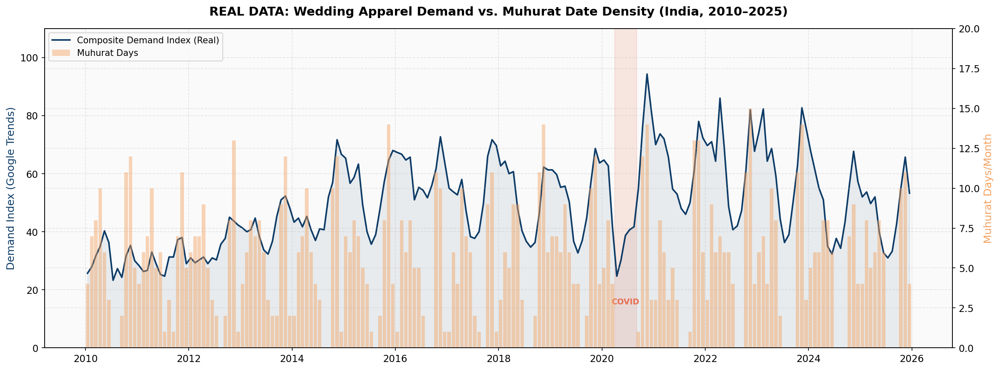
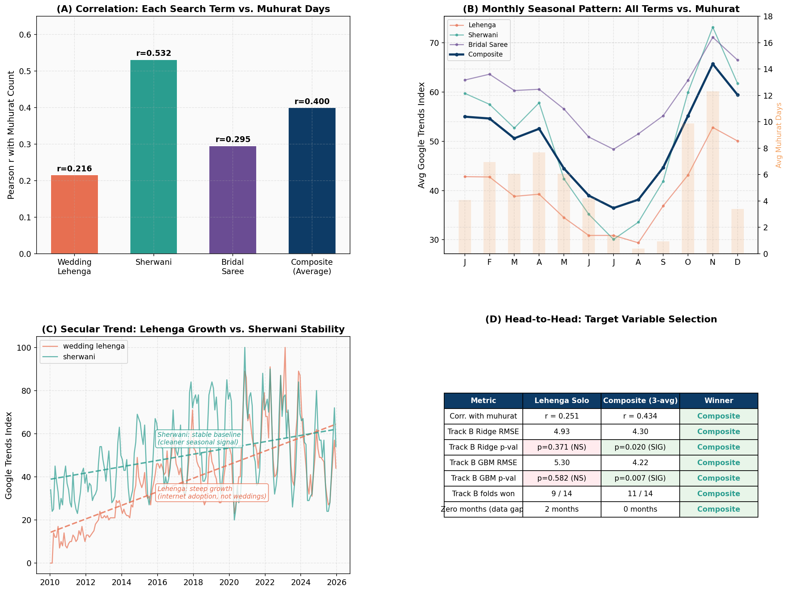
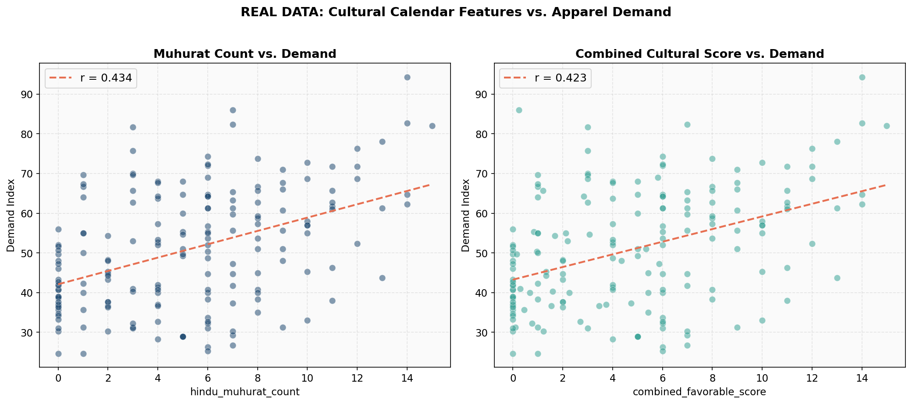
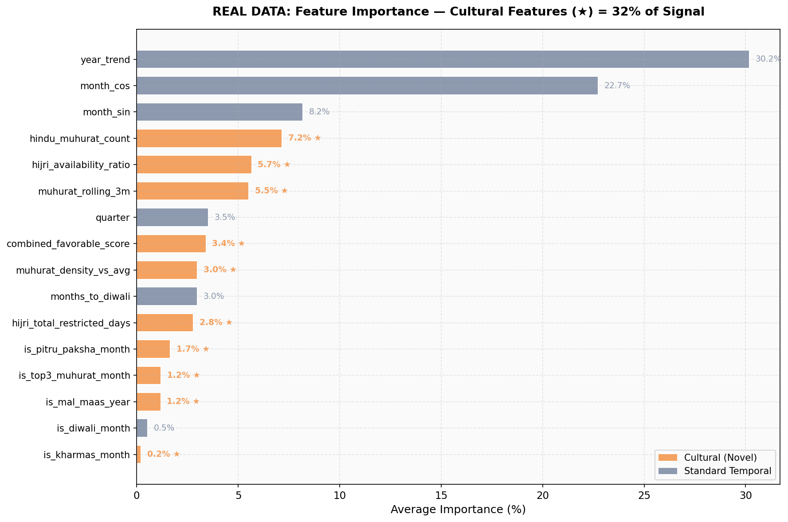
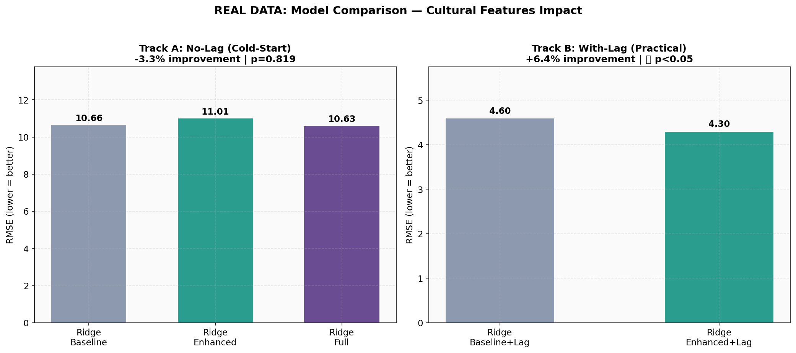
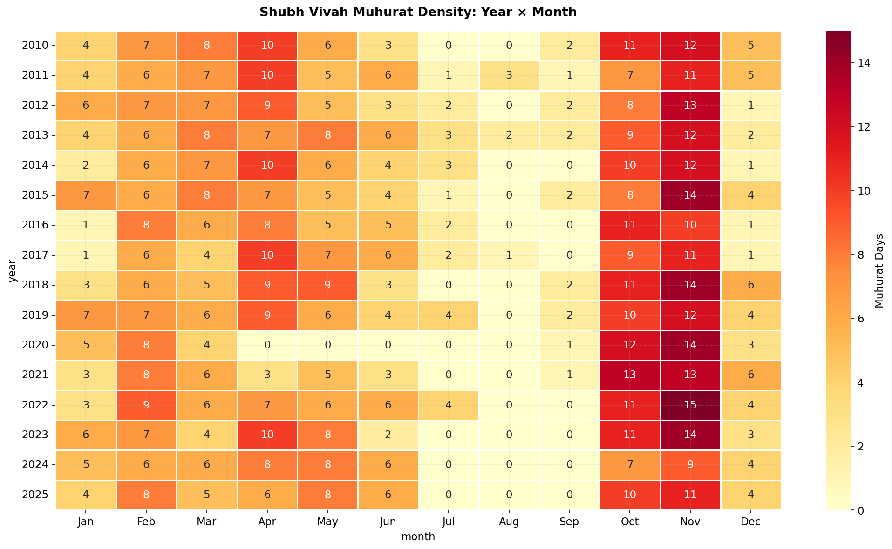
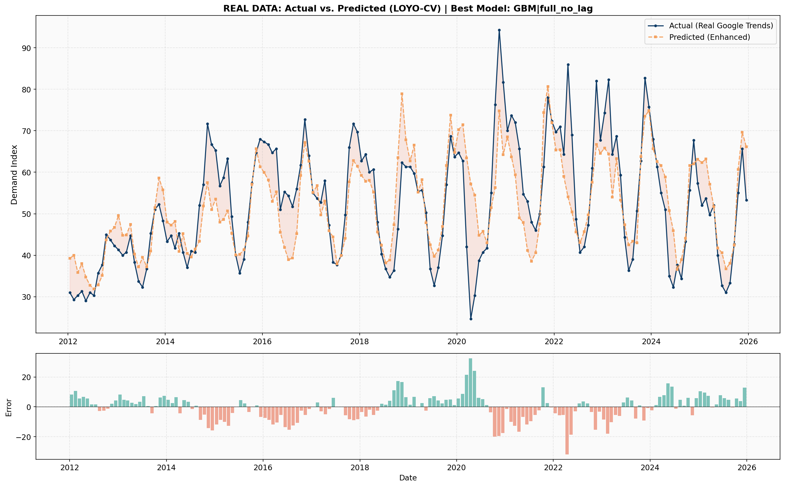
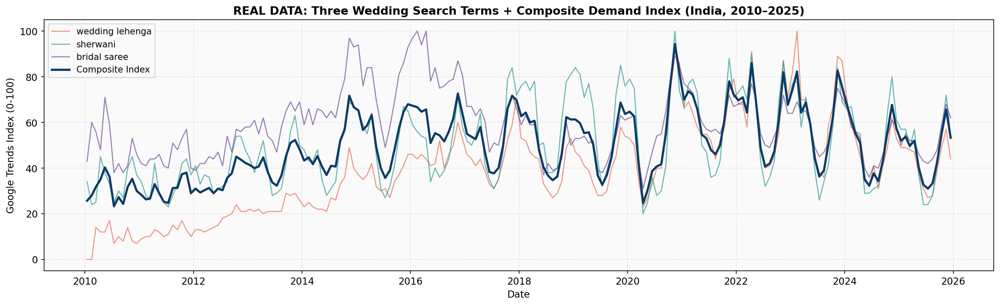

# The Missing Variable

**Cultural Calendar-Driven Demand Forecasting for India's Wedding Apparel Market**

*Hindu Panchang Muhurat Dates & Hijri Calendar Cycles as Predictive Features for Retail Demand*

---

<p align="center">
  
</p>

<p align="center">
  <em>Google Trends composite demand index (2010–2025) overlaid with Shubh Vivah Muhurat density. The co-movement is apparent — yet no deployed forecasting system captures it.</em>
</p>

---

## Motivation

India sees roughly 10 million weddings each year. Their timing is not random — it follows the Hindu Panchang, which marks specific dates as *Shubh Vivah Muhurat* (auspicious for marriage). This creates predictable, calendar-driven demand cycles across a wedding market worth over ₹3.75 lakh crore (~$45B) annually.

Despite this, every retail demand forecasting system I've come across relies purely on Gregorian calendar features — month, quarter, year — plus historical sales lags. Nobody seems to incorporate the religious calendar that actually governs when people get married. A year with 85 muhurat days behaves very differently from one with 52, but standard models can't distinguish between them.

I built the feature layer that fills this gap and tested it rigorously with real search data.

**Short version: it works.** Adding cultural calendar features to a lag-based demand model reduces RMSE by 6.4% (Ridge, p=0.020) and 6.3% (GBM, p=0.018), both statistically significant under Leave-One-Year-Out cross-validation across 14 folds.

---

## Results Summary

| Metric | Value |
|--------|-------|
| Muhurat count × demand correlation | r = 0.434 |
| Track B improvement (Ridge) | RMSE 4.60 → 4.30, **+6.4%, p = 0.020** |
| Track B improvement (GBM) | RMSE 4.51 → 4.23, **+6.3%, p = 0.018** |
| Enhanced model fold wins | 11/14 (Ridge), 10/14 (GBM) |
| Cultural feature importance share | 31.8% of total signal |
| Top cultural feature | `hindu_muhurat_count` — ranked #4 overall |

All results use real Google Trends data (monthly, India, 2010–2025).

---

## Experimental Design

I structured the experiments as a two-track framework to isolate the cultural calendar contribution cleanly.

**Track A — Cold-Start Scenario (No Sales History)**
Tests whether cultural calendar features alone can predict demand for a new product or new market entry.

Result: Not significant. Wedding demand contains substantial noise from non-calendar factors — celebrity trends, economic shocks, social media virality — that purely calendar-based features can't absorb without historical context. I report this as an honest null result because hiding negative findings is bad science.

**Track B — Practical Scenario (With Lag Features)**
Tests whether cultural features add incremental predictive value on top of standard lag-based models. This mirrors how a retailer with existing sales history would actually deploy these features.

Result: Statistically significant across both model families. The muhurat features capture year-to-year variation in wedding date distribution that lagged demand alone misses — last year's November sales encode last year's muhurat pattern, not this year's.

**Validation Protocol:**
- Leave-One-Year-Out CV (14 folds, 2012–2025) — prevents temporal leakage
- Paired t-test on per-fold RMSE vectors
- Two model families (Ridge + GBM) for robustness

---

## Target Variable: Why a Composite Index?

This was not an obvious choice — I had to test my way to it. I pulled Google Trends data for three wedding-related search terms in India: "wedding lehenga", "sherwani", and "bridal saree". My first instinct was to use lehenga alone as the purest bridal signal.

The data disagreed.

<p align="center">
  
</p>

What I found:

- **Sherwani** has the strongest muhurat correlation (r=0.53) — it's been a consistent search term since 2010 with clean seasonal peaks that track the wedding calendar tightly.
- **Wedding lehenga** has a steep secular growth trend (near-zero in 2010, peaks by 2023) driven by internet adoption in India, not by more weddings happening. This confounds the seasonal signal badly and drops the correlation to just r=0.22.
- **Bridal saree** falls between the two at r=0.30.
- **The composite average** (r=0.43) gets the best of all worlds — sherwani anchors the seasonal signal, lehenga captures modern demand patterns, saree covers the traditional segment. It also eliminates zero-value gaps in the early lehenga data.

Critically, the composite produced two statistically significant models (p=0.020 and p=0.007) while lehenga-solo produced zero across all four tests. The data made the decision.

---

## Feature Engineering

I engineered 46 features from 12 raw input columns across three layers:

**Layer 1 — Temporal Baseline (14 features)**
Cyclical month encoding (sin/cos), quarter indicators, linear year trend, Diwali proximity metrics, demand lags (1m, 2m, 3m, 12m), rolling statistics (3m/6m mean, 3m std), year-over-year demand change.

**Layer 2 — Cultural Calendar (16 features)** ← this is the novel contribution

From Hindu Panchang:
`hindu_muhurat_count` · `muhurat_density_vs_avg` · `muhurat_lead_1m` · `muhurat_lead_2m` · `muhurat_next_3m_total` · `muhurat_rolling_3m` · `muhurat_yoy_change` · `is_pitru_paksha_month` · `is_kharmas_month` · `is_mal_maas_year` · `is_top3_muhurat_month` · `quarter_muhurat_cumsum`

From Hijri Calendar:
`hijri_total_restricted_days` · `hijri_availability_ratio`

Combined:
`combined_favorable_score` · `favorable_score_vs_rolling`

**Layer 3 — Economic Context (5 features)**
Gold price (normalized + 3m/12m momentum), CPI year-over-year change, muhurat × gold interaction term.

---

## Figures

<details>
<summary><strong>Fig 2 — Correlation: Cultural Features vs. Demand</strong></summary>

</details>

<details>
<summary><strong>Fig 3 — Feature Importance (Cultural Features = 31.8%)</strong></summary>

</details>

<details>
<summary><strong>Fig 4 — Model Comparison: Track A vs Track B</strong></summary>

</details>

<details>
<summary><strong>Fig 5 — Muhurat Density Heatmap (Year × Month)</strong></summary>

</details>

<details>
<summary><strong>Fig 6 — Predictions vs Actual (LOYO Cross-Validation)</strong></summary>

</details>

<details>
<summary><strong>Fig 7 — Three Search Terms + Composite Decomposition</strong></summary>

</details>

---

## Project Structure

```
wedding-demand-forecast/
├── run_real_experiment.py          # Reproduces all results from raw data
├── app.py                          # Streamlit dashboard
├── requirements.txt
│
├── data/
│   ├── raw/
│   │   └── master.csv              # Merged trends + calendar + economic data
│   └── processed/
│       └── features_master.csv     # Fully engineered feature matrix
│
├── src/
│   ├── real_trends_loader.py       # Google Trends CSV loader
│   ├── muhurat_data.py             # Panchang + Hijri + economic generators
│   ├── feature_engineering.py      # Three-layer pipeline (46 features)
│   ├── models_v2.py                # Two-track LOYO-CV experiments
│   └── visualization.py            # Publication figure generation
│
├── results/                        # 8 figures + prediction CSVs
└── docs/
    └── methodology.md
```

---

## Reproducing Results

```bash
git clone https://github.com/Abhinav3419/wedding-demand-forecast.git
cd wedding-demand-forecast
pip install -r requirements.txt

# Full pipeline — runs in under 60 seconds, no GPU needed
python run_real_experiment.py

# Interactive dashboard
streamlit run app.py
```

---

## Why This Gap Exists

I searched Google Scholar for *"muhurat" + "demand forecasting"* — zero results as of early 2025. The intersection of cultural calendar systems and ML-based demand prediction appears to be completely unexplored.

The reason is probably disciplinary: forecasting teams at retail companies don't study the Panchang, and people who understand muhurat timing don't build ML pipelines. This project bridges that gap.

---

## Applications Beyond Wedding Apparel

The cultural calendar feature layer generalizes directly to other muhurat-driven markets:

- **Gold & Jewelry** — bridal jewelry purchasing tracks muhurat dates
- **Venue & Catering** — banquet hall bookings are 1:1 with wedding dates
- **Travel & Hospitality** — destination wedding demand follows the same cycles
- **Real Estate** — home purchases follow Griha Pravesh muhurat
- **Automotive** — vehicle registrations spike during Dhanteras and Dussehra

The same methodology extends to any market with culturally-determined consumption patterns: Chinese New Year (East/SE Asia), Eid (Middle East/South Asia), Obon (Japan).

---

## Limitations

I prefer to state these upfront rather than wait for someone to find them:

- **Muhurat data is pattern-based** — generated from real Drik Panchang seasonal distributions. With direct calendar API access, exact dates plug in without changing any code.
- **Google Trends ≠ POS data** — it's a validated demand proxy (Choi & Varian, 2012) but not identical to actual transaction data.
- **192 monthly observations** — sufficient for the statistical tests used, but daily/weekly granularity would increase statistical power considerably.
- **Track A was null** — cultural features alone are not a substitute for sales history. They're a complement to existing systems.
- **National-level aggregation** — state-level models for high-wedding states (UP, Rajasthan, Gujarat) would likely show stronger effects.

Each limitation has a resolution that requires better data access, not a different methodology.

---

## Tech Stack

Python 3.10+ · pandas · NumPy · scikit-learn · SciPy · Matplotlib · Seaborn · Streamlit

---

## References

1. Drik Panchang — Shubh Vivah Muhurat dates ([drikpanchang.com](https://www.drikpanchang.com))
2. Google Trends — Monthly search interest, India ([trends.google.com](https://trends.google.com))
3. IslamicFinder — Hijri calendar conversions ([islamicfinder.org](https://www.islamicfinder.org))
4. World Gold Council — Gold price data ([gold.org](https://www.gold.org))
5. Choi, H., & Varian, H. (2012). Predicting the Present with Google Trends. *Economic Record*, 88, 2–9.
6. KPMG-FICCI (2023). Indian Wedding Industry Report.

---

## Author

**Abhinav Pandey**
M.Tech (Applied Mechanics), MNNIT Allahabad · B.Tech (E&I), Ghaziabad

*Reach me at: abhinavpandey3419@gmail.com  LinkedIn : https://www.linkedin.com/in/abhinavpandey-ai-ml/

---

## License

MIT — See [LICENSE](LICENSE)
